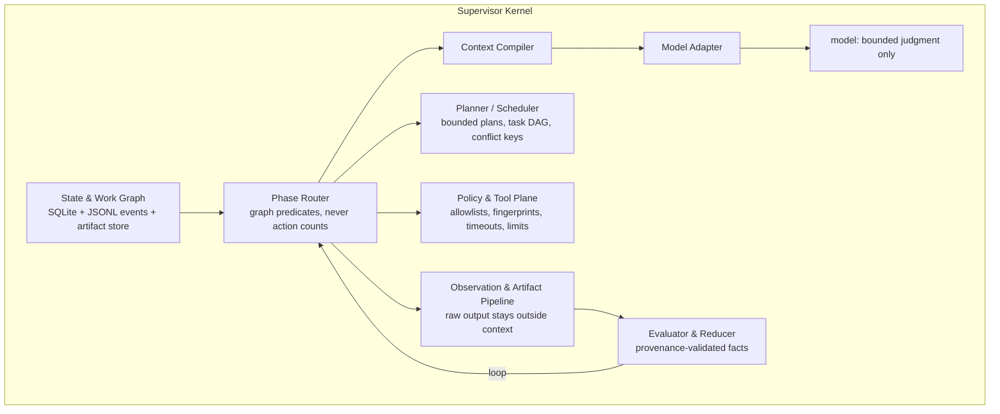

<div align="center">

# OzzGraph

**A model-adaptive autonomous CTF agent harness for authorized, isolated security challenges.**

[](https://github.com/carterlasalle/ozzgraph/actions/workflows/ci.yml)
[](https://docs.python.org/3.12/)
[](https://docs.astral.sh/uv/)

[Quick start](#quick-start) · [Documentation](#documentation) · [Repository layout](#repository-layout) · [Development](#development-commands) · [Container image](#container-image) · [Safety model](#safety-model)

</div>

OzzGraph wraps a small deterministic kernel around a planner–executor–evaluator
loop so even modest models behave like disciplined security operators.

The core principle:

> The model supplies judgment when the next action is uncertain. The harness
> supplies memory, discipline, tools, safety boundaries, execution, evidence,
> and recovery.



**Release status: v1.0.0 — shipped.** All 32 PRs of the implementation plan are
merged, every Definition of Done item passed the PR32 rehearsal (19/19), and
the [v1.0.0 GitHub release](https://github.com/carterlasalle/ozzgraph/releases/tag/v1.0.0)
has been cut. See [docs/RELEASE.md](docs/RELEASE.md) for release ops.

## What the harness does

| Area | What OzzGraph provides |
| --- | --- |
| Security phases | Ozz-style BOOTSTRAP → RECON → ENUMERATION → EXPLOITATION → POST_EXPLOITATION → PIVOT → FLAG_HUNT → VERIFY_AND_SUBMIT → REPLAN → DONE, driven by **graph-state predicates, never action counts** |
| Authoritative state | SQLite state graph (`graph.db`), append-only JSONL event log (`actions.jsonl`), content-addressed artifact store — replaying the log reconstructs the identical graph hash |
| Bounded actions | One action per executor turn with a timeout, output limit, and normalized fingerprint; duplicates/failed fingerprints never retried |
| Lazy skills | Compact per-phase summaries advertised to the model; full skill cards load only when selected |
| Model adapters | Three protocols — terminal-native free text, strict three-line, structured JSON — each with its own prompt compiler, parser, and deterministic repair |
| Planner–Executor–Evaluator | Bounded ranked plans only when the graph branches; deterministic evaluation with replanning, abandonment, loop recovery |
| Safety boundaries | Command-length limits, target allowlists, platform/internet blocking, per-phase command families, supervisor-only flag submission + paid hints (`halctl` only adapter) |
| Parallel workers | Task DAG scheduler with conflict keys, scope-limited specialists, reducer that merges validated findings into facts |
| Deterministic bootstrap | Parses targets, retrieves status, submits smoke flag, requests free hint, probes reachability before the main loop |
| Optional dashboard | Strict-TypeScript, zero-runtime-dependency read-only viewer (runs, graph, events, artifacts, metrics, replay) outside the image |

## Safety model

OzzGraph is a security harness: it intentionally makes dangerous or
unverifiable paths hard or impossible. The model is **untrusted**; the harness
owns all safety boundaries.

- **State lives outside model context.** SQLite graph, append-only JSONL
  events, and a content-addressed artifact store are authoritative. A model
  claim is a hypothesis, never confirmed state; facts require deterministic
  evidence.
- **One bounded action per turn.** Every action has a timeout, an output
  limit, and a normalized fingerprint. Duplicates and failed fingerprints are
  never retried (loop prevention). No multi-command plans disguised as one
  action.
- **No raw MCP.** Models never call MCP directly; `halctl` is the only adapter
  surface, and only the supervisor may submit flags, buy paid hints, or exit
  the run (`OZZGRAPH_HAL_PRIVILEGED`).
- **Command and target allowlists.** Command-length limits, target allowlists,
  and platform / public-internet destination blocking are enforced before
  execution. Per-phase command families gate what a worker may run.
- **Deterministic, provenance-validated facts.** Every `Fact` references
  evidence; every evidence references an observation or artifact; replaying
  the event log reconstructs the identical graph hash.
- **Authorized, isolated environments only.** OzzGraph is designed for
  sanctioned CTF challenges, never production or public-internet targets.

What OzzGraph does **not** guarantee: it does not sandbox a hostile model's
*output* from influencing a run beyond the above controls, and it is not a
general-purpose automation framework. See [SECURITY.md](SECURITY.md) for
vulnerability reporting and the full threat model.

## Quick start

Requirements: Python 3.12+ and [uv](https://docs.astral.sh/uv/).

```bash
# 1. Install dependencies
uv sync

# 2. Configure (all configuration is environment-driven; see docs/USAGE.md)
export HAL_USER_ID=team-42
export OZZGRAPH_CHALLENGE_ID=challenge-01
export OZZGRAPH_TARGET=http://127.0.0.1:8000
export OZZGRAPH_TARGET_ALLOWLIST=127.0.0.1
export OZZGRAPH_MODEL_BASE_URL=http://127.0.0.1:8000/v1   # OpenAI-compatible
export OZZGRAPH_MODEL_API_KEY=...                          # optional

# 3. Run the harness
uv run python -m ozzgraph
```

The run prints the identity line (`USER ID: team-42`), runs deterministic
bootstrap reconnaissance, then executes the bounded loop until a budget is
exhausted, a signal arrives, or the run completes — always ending with a
human-readable `TERMINATION: <reason>` line (exit codes: `0` completed, `1`
failed, `130` interrupted, `3` budget exhausted). State and artifacts are
written to `state/` by default (`state/actions.jsonl`, `state/graph.db`,
`state/artifacts/`).

### Talking to the challenge platform (`halctl`)

`halctl` is the local terminal-native adapter for the HalCTF MCP integration.
Each subcommand prints exactly one JSON document:

```bash
uv run halctl challenge show --challenge-id "$OZZGRAPH_CHALLENGE_ID"
uv run halctl status --challenge-id "$OZZGRAPH_CHALLENGE_ID"
uv run halctl submit --flag 'flag{...}' --challenge-id "$OZZGRAPH_CHALLENGE_ID"
uv run halctl hint --index 0 --challenge-id "$OZZGRAPH_CHALLENGE_ID"
uv run halctl scoreboard
uv run halctl exit --reason completed
```

Flag submission, paid hints (`--index` > 0), and `exit` are
**supervisor-only**: they fail unless `OZZGRAPH_HAL_PRIVILEGED` is set, which
only the supervisor does. See [docs/USAGE.md](docs/USAGE.md) for the full
walkthrough.

## Documentation

| Document | Purpose |
| --- | --- |
| [docs/USAGE.md](docs/USAGE.md) | install, configuration, running a capture, replay, lifecycle |
| [docs/CUSTOMIZATION.md](docs/CUSTOMIZATION.md) | model profiles + adapters, skills, policies, workers |
| [docs/PRD.md](docs/PRD.md) · [docs/ARCHITECTURE.md](docs/ARCHITECTURE.md) · [docs/TECHNICAL_REQUIREMENTS.md](docs/TECHNICAL_REQUIREMENTS.md) | product, architecture, technical requirements |
| [docs/DATA_STRATEGY.md](docs/DATA_STRATEGY.md) · [docs/API_AND_INTEGRATIONS.md](docs/API_AND_INTEGRATIONS.md) | data strategy, API and integrations |
| [docs/TESTING_AND_QA.md](docs/TESTING_AND_QA.md) · [docs/GOLDEN_TRACES.md](docs/GOLDEN_TRACES.md) | testing/QA gates, golden traces |
| [docs/SYNTHETIC_LAB.md](docs/SYNTHETIC_LAB.md) · [docs/IMAGE_HARDENING.md](docs/IMAGE_HARDENING.md) | synthetic lab, container hardening |
| [docs/RELEASE.md](docs/RELEASE.md) · [docs/IMPLEMENTATION_PLAN.md](docs/IMPLEMENTATION_PLAN.md) | release ops, implementation plan |
| [docs/adr/](docs/adr/) | architecture decision records |
| [AGENTS.md](AGENTS.md) · [CONTRIBUTING.md](CONTRIBUTING.md) · [SECURITY.md](SECURITY.md) | agent governance, contribution workflow, security policy |

## Repository Layout

```text
ozzgraph/
├── pyproject.toml          # package metadata, scripts, tool config
├── uv.lock
├── Dockerfile              # immutable competition image (see docs/IMAGE_HARDENING.md)
├── README.md
├── AGENTS.md               # coding-agent governance for this repo
├── CONTRIBUTING.md         # build/test/lint/PR workflow
├── SECURITY.md             # vulnerability reporting + security model
├── .github/workflows/ci.yml
├── docs/                   # PRD, architecture, API, ADRs, usage, customization, ...
├── scripts/                # e.g. SBOM generation
├── src/ozzgraph/           # the harness kernel (halctl entry point too)
├── tests/                  # pytest suite (unit, integration, chaos, replay, ...)
└── dashboard/              # optional read-only TS dashboard (outside the image)
```

## Development Commands

| Command | Purpose |
| --- | --- |
| `uv sync` | install dependencies into `.venv` |
| `uv run ruff check .` | lint |
| `uv run ruff format --check .` | format check (also checks Python blocks inside `docs/`) |
| `uv run mypy src` | strict typing |
| `uv run pytest` | full test suite (880 tests) |

The optional dashboard (setup and endpoints: [API_AND_INTEGRATIONS.md](docs/API_AND_INTEGRATIONS.md)
§ Optional Dashboard API) lives in `dashboard/`:

```bash
cd dashboard
yarn install
yarn lint && yarn typecheck && yarn test && yarn build
yarn start --runs-dir ../state --host 127.0.0.1 --port 8787
```

## Container Image

```bash
docker build -t ozzgraph .
docker run --rm ozzgraph --version
docker run --rm --read-only --tmpfs /tmp \
  -e HAL_USER_ID=team-42 \
  -e OZZGRAPH_MAX_RUNTIME_S=7200 \
  ozzgraph
```

The image is a multi-stage, non-root (uid 10001), read-only-rootfs runtime
with `halctl` on PATH; state and artifacts live under
`/var/lib/ozzgraph/state` (mount `-v /host/state:/var/lib/ozzgraph/state` to
persist). Build recipe, size budget (<1.5 GB), SBOM generation, and startup
measurements: [docs/IMAGE_HARDENING.md](docs/IMAGE_HARDENING.md).
